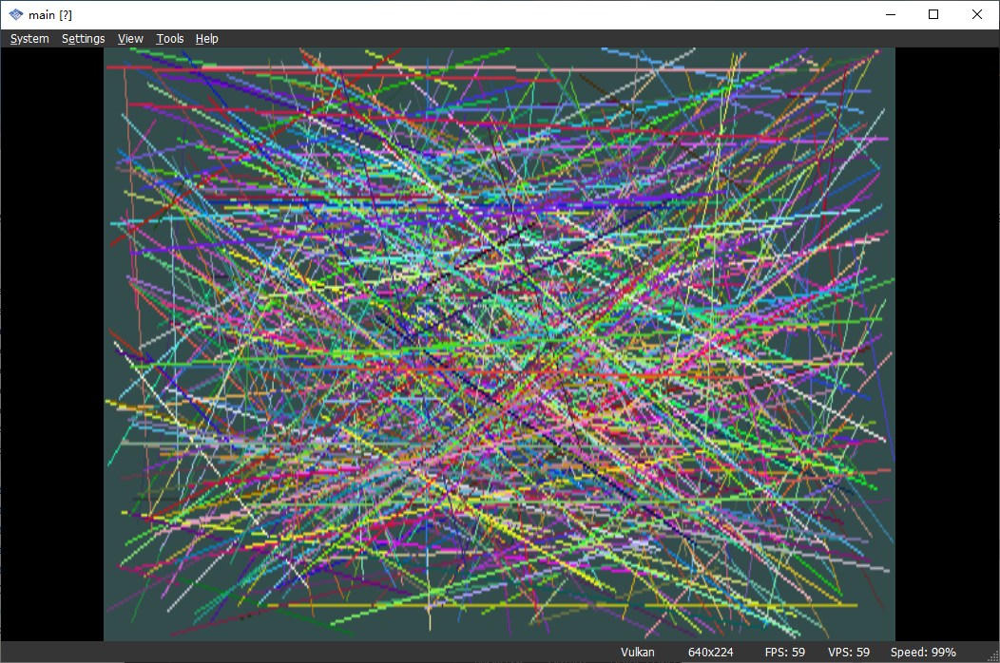

# PS2_helloworld



A basic ps2 app

# Config PS2 toolchain

1. Download PS2 toolchain
    - https://github.com/ps2dev/ps2dev/releases/tag/latest
    - https://github.com/ps2dev/ps2dev/releases/download/latest/ps2dev-ubuntu-latest.tar.gz
2. Config `PATH`

```bash
export PS2DEV=/usr/local/ps2dev
export PS2SDK=$PS2DEV/ps2sdk
export GSKIT=$PS2DEV/gsKit
export PATH=$PATH:$PS2DEV/bin:$PS2DEV/ee/bin:$PS2DEV/iop/bin:$PS2DEV/dvp/bin:$PS2SDK/bin
```

# Referencs
https://github.com/ps2dev/ps2dev
https://github.com/ps2dev/ps2sdk
https://github.com/jur/ps2tut_01